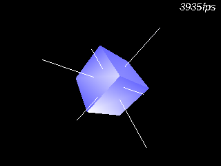

# NoSYS

Platform independent framework based on:

- [GLFW] platform abstraction framework
- [QuesoGLC] opengl font library
- [SAIL] image load/save library
- [OpenNMA] linear algebra math library



# Usage

```c++
#include <NoSYS/glfw.hpp>

col::u16<5,6,5> bfcolor = { 12, 23, 26 };
col::u8<4>      vccolor = (col::u8<4>)bfcolor;
box<sca::f32>   cube;

int main(int argc, char** argv)
{
    sys::init();
    while(sys::tick())
    {
        sys::sclr();

        glRotatef((f32)sys::time.now * 100.0f, 1.0f, 0.0f, 1.0f);
        cube.draw();

        sys::time.draw_fps();
        sys::swap();
    }
    sys::halt();
    exit(SUCCESS);

}
```

# Links
- [OpenNMA]
- [GLFW]
- [QuesoGLC]
- [SAIL]

[OpenNMA]: https://codeberg.org/forcemaster/OpenNMA
[GLFW]: https://github.com/glfw/glfw
[QuesoGLC]: https://sourceforge.net/projects/quesoglc/
[SAIL]: https://github.com/HappySeaFox/sail
