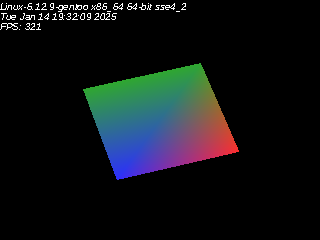

# nosys

Platform independent C/C++ demo/game framework based on:

- [GLFW] platform abstraction framework
- [quesoglc] free implementation of the OpenGL Character Renderer 



# Usage

```c
#include <nosys.h>

int main(int argc, char** argv)
{
    sys_make(320,240,"sys_glfw");

    sys_init(sys);

    do
    {
    } while(sys_clr(sys) && sys_draw_test(sys) && sys_swap(sys));

    exit(sys_halt(sys) && sys_free(sys) ? EXIT_SUCCESS : EXIT_FAILURE);
}
```

# Links
- [GLFW]
- [quesoglc]

[GLFW]: https://github.com/glfw/glfw
[quesoglc]: https://sf.net/p/quesoglc/code
